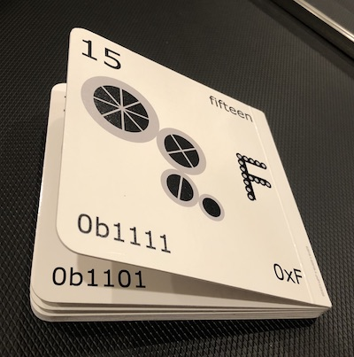
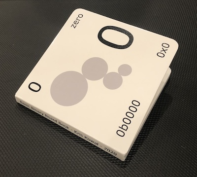
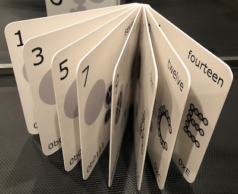
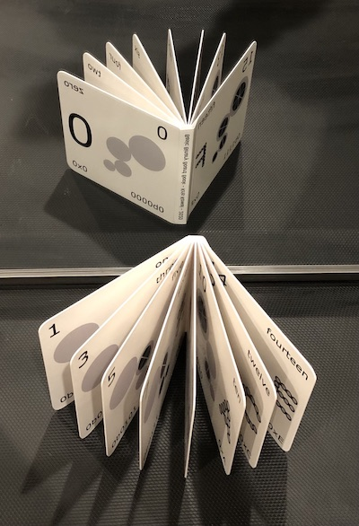

# Basic Binary Board Book

Each page of this board book for sublimating binary into baby brains depicts
the number from 0 to 15 in decimal, hexadecimal, binary, English, a binary
illustration of place-value in the first four powers of two, and a hexadecimal
numeral illustration with counting dots.

Don’t worry if you don’t understand the depictions!
The idea is for your kiddo to puzzle out the relationships between these
representations and maybe recall them later in life.
Understanding place value in binary is easy and could make it easier to
understand decimal place value in middle school.

To get a print, submit the PDFs here for the cover spread and interior spreads
of a 16 page board book with
[Pint Size Productions](https://customboardbooks.pintsizeproductions.com/product/designer-board-book-16-page).

Copyright 2020 Kris Kowal 
[Creative Commons Zero 1.0](LICENSE)
